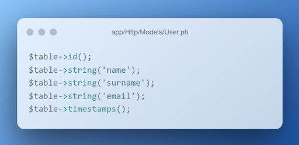

# Продвинутое программирование на PHP — Laravel
## Домашняя работа №7

---

В этой практической работе вы будете разрабатывать контроллер, который позволит выводить информацию об одном и обо всех пользователях из базы данных, сохранять данные о новом пользователе в БД, а также создавать PDF с информацией о пользователе.
### 1. Установите новое приложение Laravel и настройте подключение к базе данных. Напомним, что создать новое приложение можно с помощью команды composer:

composer create-project laravel/laravel crud

Добавьте необходимые переменные окружения в ENV-файл корневого каталога приложения.

---

---

### 2. Создайте новую модель Eloquent c помощью команды:

php artisan make:model User -mfsc

Напомним, что флаг -mfsc создаст модель, наполнитель, контроллер и файл миграции.
После опишите схему базы данных в методе up() файла .app/Http/Models/User.php.

---

---

После описания схемы таблицы базы данных запустите миграцию.

### 3. Создайте необходимые роуты в файле web.php. Ваше приложение должно содержать минимум четыре эндпоинта:
   — для получения всех пользователей из БД;
   — получения одного пользователя через id, переданный в параметрах роута;
   — записи нового пользователя в базу данных;
   — получения данных о пользователе в виде PDF-файла.

---

---

### 4. Создайте новый blade-шаблон. В blade-шаблоне создайте форму, которая будет отправлять данные о работнике. Важно, чтобы поля HTML-формы были сопоставимы с полями таблицы базы данных. При отправке запроса экземпляр класса request должен содержать данные об имени, фамилии и адресе электронной почты пользователя.
   Форма blade-шаблона должна содержать CSRF-токен, поля формы должны быть обязательны к заполнению (используйте атрибут required).

### 5. В контроллере UserController.php опишите функцию store, которая будет сохранять данные из вашей HTML-формы. Добавьте валидацию.

---

---

Дополнительно. Добавьте валидацию на количество символов (максимальное количество символов — 50) для полей Name и Surname. Для почты добавьте валидацию в виде регулярного выражения на соответствие виду example@mail.com.

---

---

### 6. Добавьте соответствующие методы index и get, которые будут возвращать данные обо всех пользователях и об одном пользователе по переданному id. Опционально можете возвращать ответ в формате JSON.

### 7. Чтобы генерировать PDF-документ, вам понадобится DOMPDF-пакет, который является сторонней библиотекой. Для его установки выполните команду:

composer require barryvdh/laravel-dompdf

— В файле composer.json добавьте строку с указанным пакетом.
— Запустите команду composer update.
— Добавьте необходимый Service Provider и Facade в файл config/app.php.

---

---

### 8. Создайте новый контроллер для работы с PDF:

php artisan make:controller PdfGeneratorController

### 9. Опишите функцию index, которая будет возвращать новый PDF-файл.

---

---

### 10. Измените роут Route::get(‘/resume’) таким образом, чтобы он принимал id в виде параметра. Обновите функцию «index» так, чтобы PDF формировался на основе данных из таблицы по переданному id.
